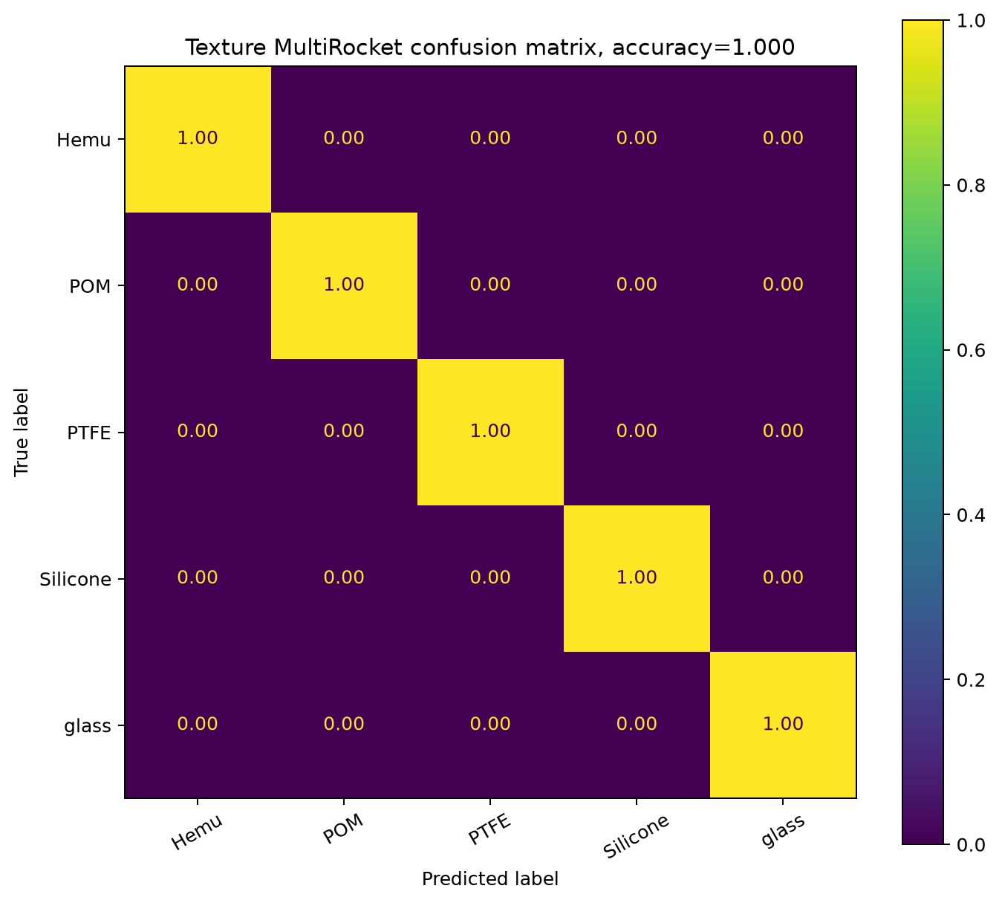
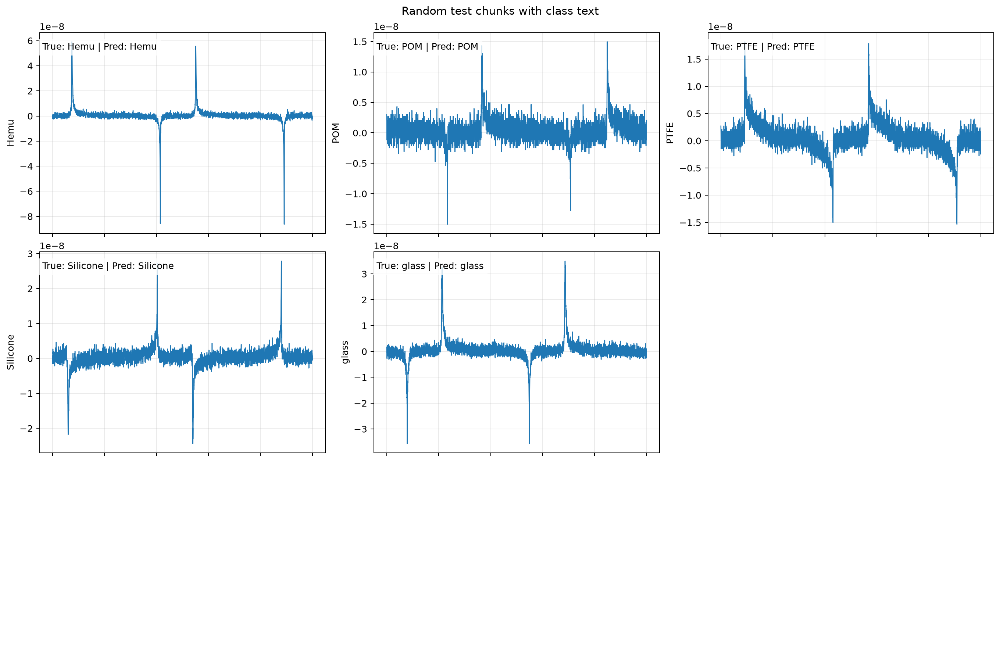
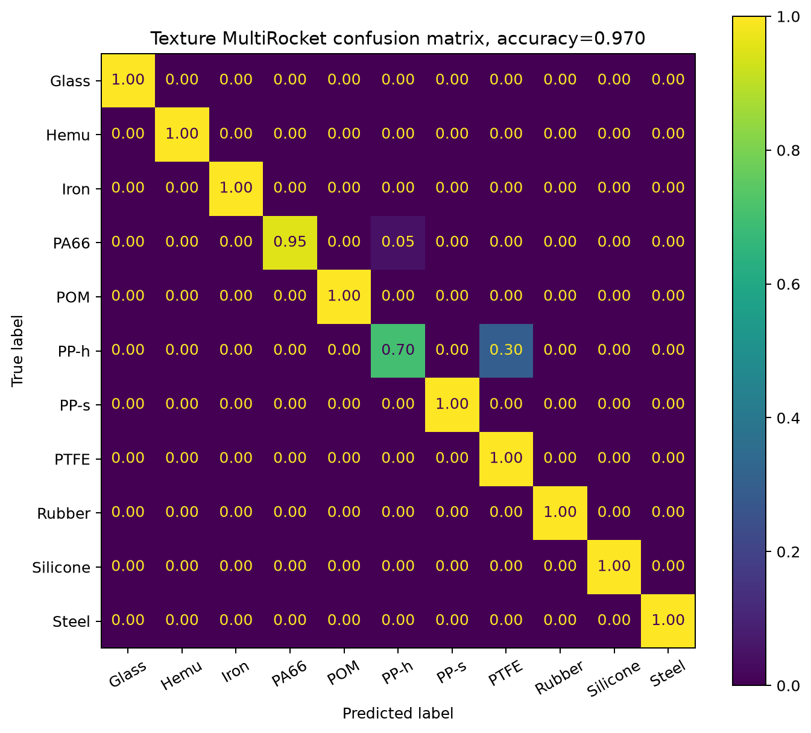
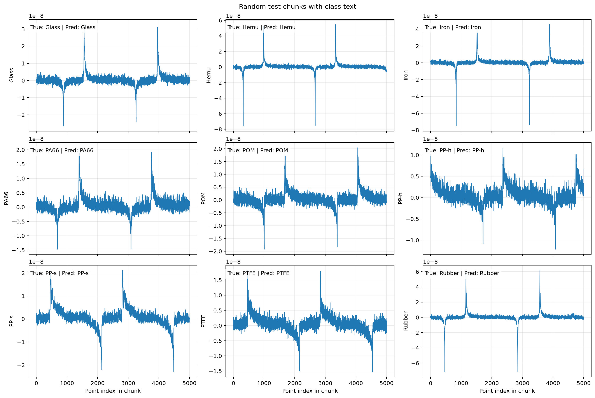
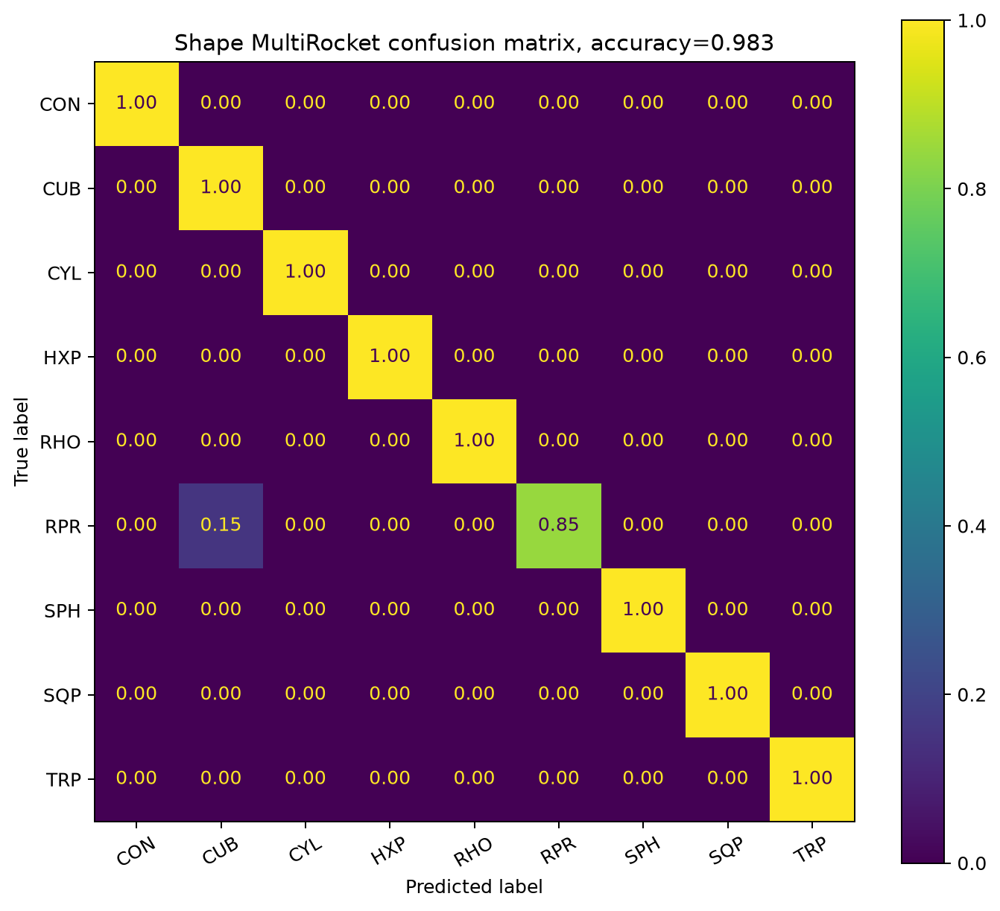
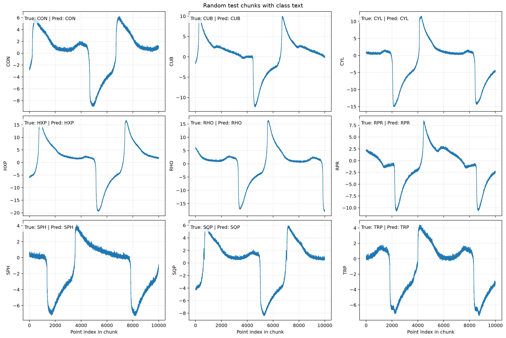

# MultiRocket training pipelines

This document explains what is done by [`train_texture_multirocket.py`](train_texture_multirocket.py) and [`train_shape_multirocket.py`](train_shape_multirocket.py). The texture pipeline writes its outputs to `texture_multirocket_output/` by default, while the output illustrations are the two PNG files produced by the shape experiment in `shape_multirocket_output/`.

## Overview

Both scripts solve a **univariate time-series classification** problem. A class is represented by a numeric signal column in an Excel workbook. Each long signal is cut into fixed-length windows, MultiRocket converts each window into many discriminative features, and a classifier predicts the class of unseen windows.

The shape pipeline is not an independent implementation. It reads `Shape_Test.xlsx`, then imports and reuses the windowing, duration estimation, model training, evaluation, confusion-matrix plotting, and example-window plotting functions from `train_texture_multirocket.py`.

The common workflow is:

1. Read every worksheet from the input `.xlsx` file.
2. Treat the first column as time.
3. Ignore Excel index-like columns named `Unnamed...`, `index`, or `id`.
4. Treat every remaining numeric column as a labeled class signal; rows with invalid time or signal values are removed.
5. Remove a configurable interval from the beginning and end of every signal.
6. Generate candidate fixed-length windows, optionally with overlap.
7. Select at most the configured number of windows from each trimmed source series using a seeded random generator.
8. Put the latest selected windows in the test set and retain only earlier selected windows whose end occurs before the first test window starts. Thus, training and test windows do not share source samples.
9. Fit `sktime.classification.kernel_based.RocketClassifier` with `rocket_transform="multirocket"`.
10. Predict the test labels, print accuracy and a classification report, and save a row-normalized confusion matrix and representative test signals.

### Why MultiRocket is used

MultiRocket applies a large collection of randomized convolutional kernels to the raw sequences and summarizes their responses. The resulting features capture local patterns at different scales and positions. `RocketClassifier` then learns a conventional classifier on those transformed features. Consequently, the scripts do not manually define features such as peaks, slopes, frequency components, or decay rates; MultiRocket learns a broad randomized representation directly from each window.

## Data splitting and leakage prevention

Candidate windows inside a trimmed source series may overlap when `--overlap` is enabled. However, the train/test boundary itself is disjoint:

- the final `ceil(number_of_selected_windows × test_size)` selected windows become test windows;
- a training window is admitted only if `training_start + window_points <= first_test_start`;
- windows crossing the boundary are discarded.

This is stricter than randomly splitting overlapping windows, which could place almost identical samples in training and testing and inflate accuracy. It is still a **within-series temporal holdout**, not a holdout of an entirely separate recording or workbook. Therefore, the reported accuracy measures generalization to later, non-overlapping portions of the same class series.

## `train_texture_multirocket.py`

### Purpose and defaults

This is the workbook-based texture pipeline and the shared implementation used by the shape script. It reads all worksheets from `Texture_Test.xlsx` by default, treats each remaining numeric column as a class signal, and saves its figures in `texture_multirocket_output/`. Its current defaults are:

| Setting | Default | Meaning |
|---|---:|---|
| Input | `Texture_Test.xlsx` | Workbook read from all worksheets |
| Window length | 5,000 points | Length of each model input |
| Candidate stride | 500 points | 90% overlap between adjacent 5,000-point candidates |
| Initial exclusion | 15 s | Startup/transient region omitted |
| Final exclusion | 25 s | End region omitted |
| Maximum windows | 1,000 per source series | Sampling cap |
| Test fraction | 0.10 | Fraction of selected late windows used for testing |
| MultiRocket kernels | 5,000 | Size of randomized transform |
| Random seed | 42 | Reproducible sampling/model randomness |
| CPU jobs | `-1` | Use all available CPU cores |
| Current default output | `texture_multirocket_output/` | Destination when no override is supplied |

The script does not require a fixed set of labels. Its outputs are a row-normalized confusion matrix and a seeded 3x3 figure of random test windows, with true and predicted class text in each panel. For the default `Texture_Test.xlsx` input, the generated filenames are `texture_multirocket_Texture_Test_confusion_matrix.png` and `texture_multirocket_Texture_Test_random_test_chunks_by_class.png`.

### Texture confusion matrix



The default texture run reaches **1.000 (100.0%)** test accuracy. All five displayed classes are classified correctly in the row-normalized confusion matrix.

### Texture example test windows



The figure shows one seeded test window for each of the five texture classes. Each displayed example is labeled with its true and predicted class, and all five examples are classified correctly.

### More texture confusion matrix



The `More_Texture_Test` run reaches **0.970 (97.0%)** test accuracy. Most classes are classified perfectly; the visible errors are confusion between `PA66` and `PP-h`, with 0.05 of `PA66` predicted as `PP-h`, and 0.30 of `PP-h` predicted as `PTFE`.

### More texture example test windows



This figure shows seeded representative test windows for the `More_Texture_Test` classes, with the true and predicted labels displayed in each panel.

## `train_shape_multirocket.py`

### Purpose and defaults

This wrapper specializes the shared pipeline for the nine shape classes in both worksheets of `Shape_Test.xlsx`. It expects two tabs and nine distinct labels and prints warnings if those expectations are not met.

| Setting | Default | Meaning |
|---|---:|---|
| Input | `Shape_Test.xlsx` | Both worksheets are read |
| Expected labels | 9 | `CON`, `CUB`, `CYL`, `HXP`, `RHO`, `RPR`, `SPH`, `SQP`, `TRP` |
| Window length | 10,000 points | Length of each model input |
| Candidate stride | 500 points | 95% overlap between adjacent candidates |
| Initial exclusion | 15 s | Startup/transient region omitted |
| Final exclusion | 20 s | End region omitted |
| Maximum windows | 1,000 per source series | Sampling cap |
| Test fraction | 0.10 | Fraction of selected late windows used for testing |
| MultiRocket kernels | 5,000 | Size of randomized transform |
| Random seed | 58 | Reproducible sampling/model randomness |
| Output | `shape_multirocket_output/` | Figure destination |

The abbreviations represent cone (`CON`), cube (`CUB`), cylinder (`CYL`), hexagonal prism (`HXP`), rhombus (`RHO`), rectangular prism (`RPR`), sphere (`SPH`), square pyramid (`SQP`), and triangular prism (`TRP`).

### Shape confusion matrix



The shape model reaches **0.983 (98.3%)** overall test accuracy. Eight of the nine classes have a displayed recall of 1.00. The sole visible confusion is for rectangular prism (`RPR`): 0.85 of its test windows are predicted correctly and 0.15 are predicted as cube (`CUB`). This is a plausible similarity: both shapes have rectangular planar faces, and the measured temporal response represented in the workbook may consequently share structure. That physical interpretation is a hypothesis; the figure establishes the classification confusion, not its cause.

Rows are normalized and values are rounded. The result indicates excellent separation on this temporal holdout, but it should not be interpreted as performance on an entirely unseen recording, acquisition session, or object instance unless the source workbook itself was organized to provide that separation.

### Shape example test windows



This grid contains one seeded random test window for every shape class. Each window has 10,000 points, and all nine selected examples are predicted correctly. The panels show strong differences in peak amplitude, sign changes, decay, curvature, secondary humps, and event timing. These distinctive waveform structures are consistent with the high accuracy in the confusion matrix.

Each subplot chooses its own vertical limits, so apparent amplitudes should be compared using the tick values rather than only the visual height. Also, the correctly classified `RPR` example is only one member of that class; the confusion matrix shows that other `RPR` windows were classified as `CUB`.

## Main differences between the pipelines

| Aspect | Feature pipeline | Shape pipeline |
|---|---|---|
| Role | General implementation and reusable functions | Shape-specific wrapper |
| Output illustrated in this report | Not embedded | Both shape PNG outputs |
| Default window length | 5,000 points | 10,000 points |
| Current default kernel count | 10,000 | 5,000 |
| Seed | 42 | 58 |
| Final interval removed | 25 s | 20 s |
| Observed accuracy in embedded output | Not reported here | 98.3% |
| Main observed confusion in embedded output | Not reported here | RPR→CUB |

## Running the scripts

Save texture and shape figures without opening interactive windows:

```powershell
python train_texture_multirocket.py --no-show-plots
python train_shape_multirocket.py --no-show-plots
```

Useful options include `--input`, `--window-points`, `--stride-points`, `--overlap`/`--no-overlap`, `--exclude-initial-seconds`, `--exclude-final-seconds`, `--max-chunks-per-series`, `--test-size`, `--num-kernels`, `--n-jobs`, `--seed`, and `--output-dir`.

For example, the shape run can explicitly write to the output folder used by the embedded PNG files:

```powershell
python train_shape_multirocket.py --output-dir shape_multirocket_output --no-show-plots
```

Rerunning can replace figures with the same generated names. Exact results depend on the workbook contents, package versions, parameters, and random seed.
